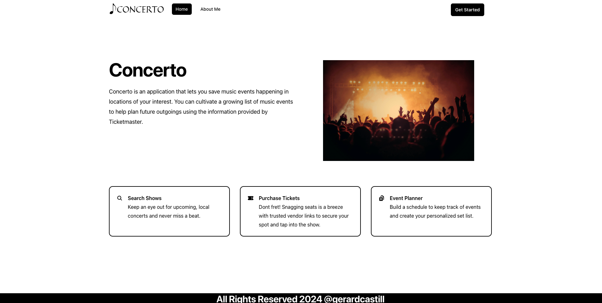
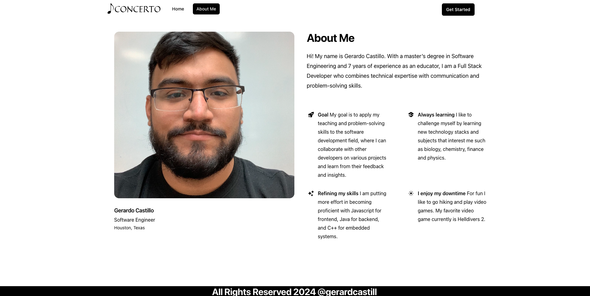
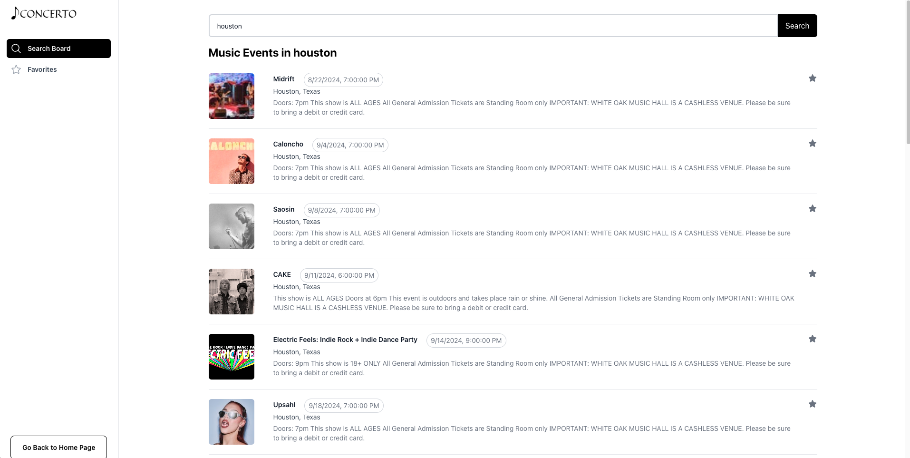
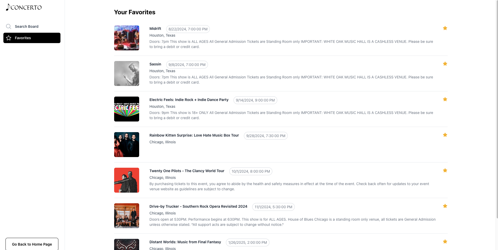

# Interactive Music Saver (Concerto)

## Table of Contents
- [Introduction](#introduction)
  - [Features](#features)
  - [Architecture](#architecture)
- [Screenshots](#screenshots)

## Introduction

Concerto is a full-stack web application built to help music lovers discover and keep track of their favorite music events. The application integrates with the Ticketmaster API to provide real-time information about music events happening in various cities.

### Features

- **Search for Concerts:** View concerts by searching cities within the U.S. sorted by current date and filtering out events that have invalid dates
- **Favorite Upcoming Concerts:** Concerts can be added to a favorites list by clicking the star next to the event which saves it to the backend API

### Architecture

- **Backend:** Django for handling API requests between frontend and Ticketmaster.
- **Frontend:** Create-React-App using Javascript for components/services and tailwindCSS for styling.
- **AWS:** S3 bucket for frontend and EC2 instance for backend

## Screenshots
Home Page

About Page

SearchBoard Page

Favorites Page

